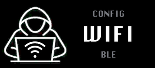
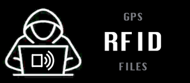
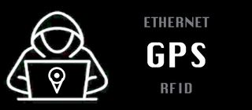
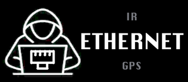
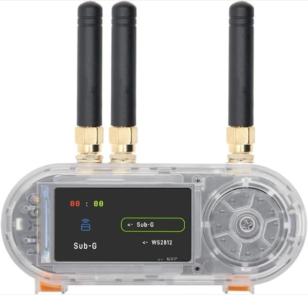

# 🖥️ Black Hack — Bruce Theme

[](https://github.com/BruceDevices/firmware) [](https://github.com/BruceDevices/firmware) [](LICENSE)

A minimalist **hacker** UI theme for the **[Bruce firmware](https://github.com/BruceDevices/firmware)**. A hooded figure sits at a laptop on the left; the icon of the **current** menu entry appears like a sticker on the back of the laptop screen. On the right, a clean vertical text menu: the current item in **big white** square type, the **previous** item above and the **next** item below, both smaller and grey.

## 🎛️ Look

| WiFi | RFID | GPS | Ethernet |
|:---:|:---:|:---:|:---:|
|  |  |  |  |

The label is **baked into the image** (`label: 0`, `border: 0`), so nothing overlaps:

- 🏷️ Only the **current** icon is shown, centred on the laptop screen.
- 🔠 Right column, top to bottom: **previous** (small grey) · **CURRENT** (big white, square font) · **next** (small grey).
- ⚙️ 16 hand-drawn pictos: WiFi, BLE, RF, NRF24, LoRa, IR, Ethernet, GPS, RFID, Files, Scripts, Clock, Others, Config (+ FM & Connect).

## 📦 Contents

`Black_Hack/` ships **4 sizes** (one per Bruce screen template), each with **16 PNG** + its `.json`:

| Folder | Image | Target screen |
|---|---|---|
| `105px/` | 240×105 | M5StickC Plus (240×135) |
| `140px/` | 320×140 | **T-Embed CC1101 / Cardputer (320×170)** |
| `180px/` | 320×180 | ~320×210 screens |
| `192px/` | 320×192 | ~320×222 screens |

> ℹ️ **Status bar** — Bruce reserves **30 px at the top** (battery / clock / WiFi). Right size = **screen height − 30**. For the **T-Embed CC1101 (320×170) → `140px`**.

## 🚀 Install

1. Copy the **`Black_Hack`** folder to the root of the SD card.
2. On the device: **Config → UI Theme → `Black_Hack/<size>/Theme_Black_Hack.json`** (`140px` for the T-Embed CC1101).
3. Over WiFi: **Files → WebUI**, upload the folder, then select the `.json`.

## 🧭 Menu order (neighbours)

The **previous / next** labels are painted into each image following Bruce's default T-Embed CC1101 menu order:

`WiFi → BLE → RF → NRF24 → LoRa → IR → Ethernet → GPS → RFID → Files → Scripts → Clock → Others → Config` (wraps).

## 🛠️ Regenerate

Icons and layout are generated by `generate_theme.py` (Python + Pillow) from `fond.png`. Each picto is cropped to its true bounding box and scaled to sit centred inside the screen panel, clear of the white outline. Edit the tunables at the top and run:

```bash
python3 generate_theme.py
```

## 🛒 Hardware

The gear used for this project — Amazon affiliate links:

| [](https://link.amazon/B0cgD7wou) | [](https://link.amazon/B071fmsbH) | [](https://link.amazon/B0eMlSqeZ) |
|:---:|:---:|:---:|
| 🔌 **[LilyGO T-Embed CC1101](https://link.amazon/B0cgD7wou)**<br><sub>with antennas</sub> | ⬛ **[LilyGO T-Embed CC1101](https://link.amazon/B071fmsbH)**<br><sub>black, no antenna</sub> | 📡 **[SMA antenna kit](https://link.amazon/B0eMlSqeZ)** |

<sub>As an Amazon Associate I earn from qualifying purchases.</sub>

## ☕ Buy me a coffee?

If you like this theme:


## 📄 License

MIT © koua29. Background art and pictos included.
